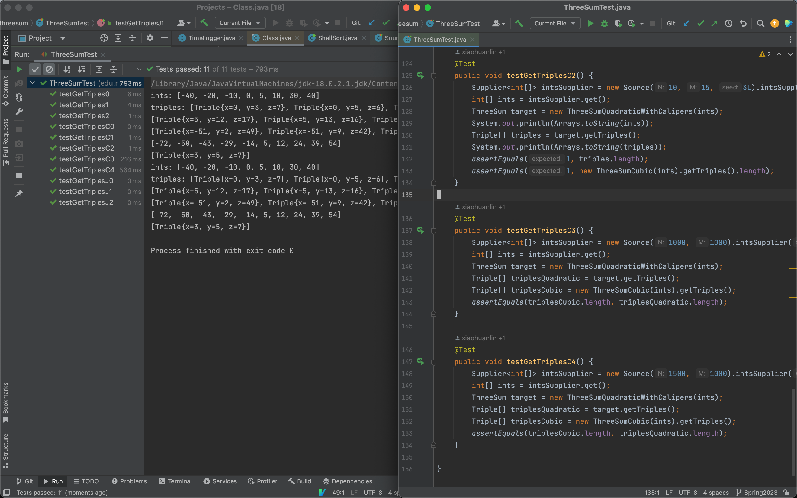
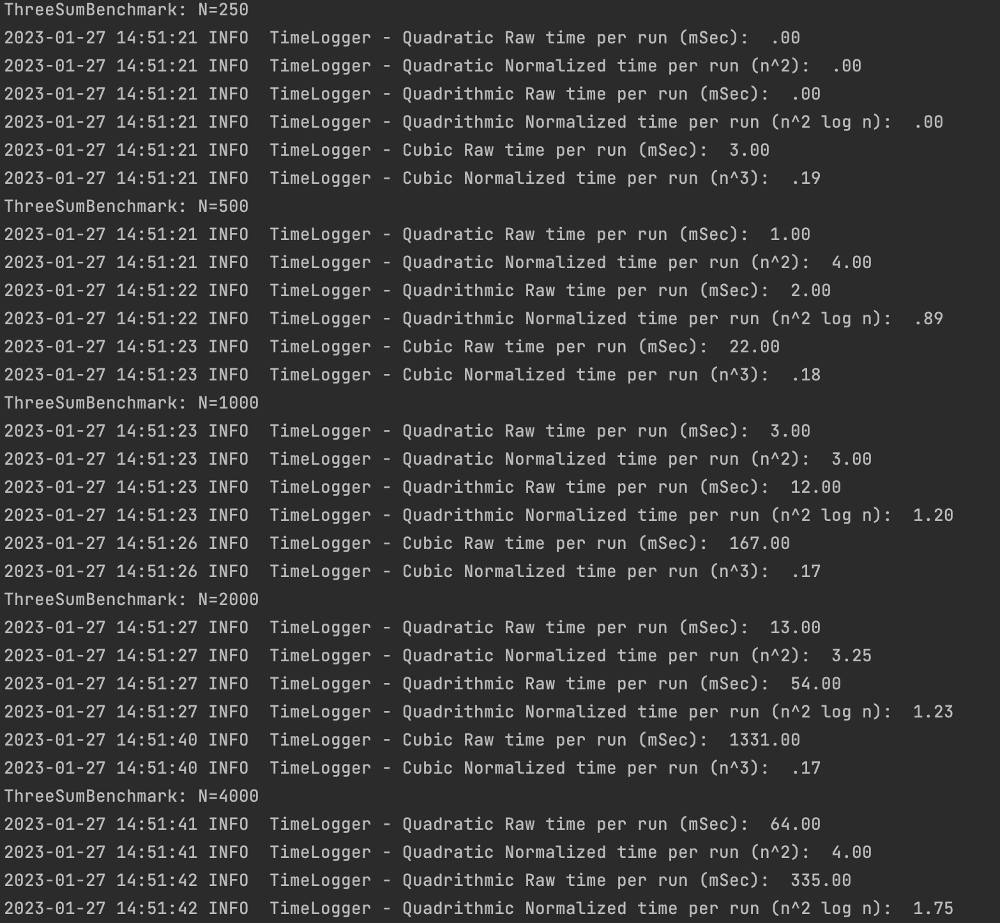
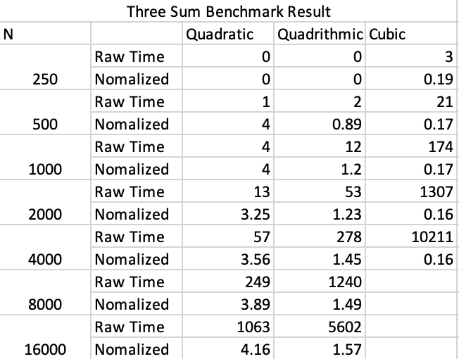
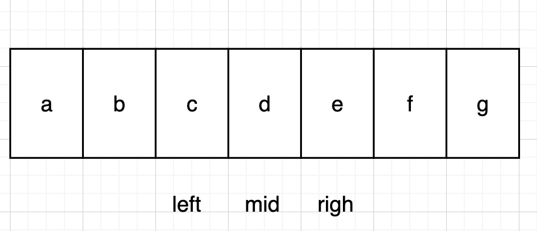
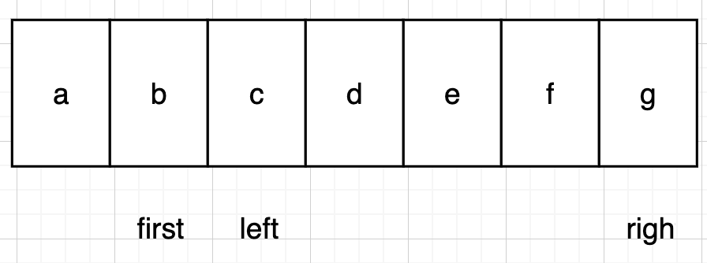

## Unit Tests Three sum



## Benchmark

> Results is from the ThreeBenchmark.java





## Algorithm Description

## Three Sum Quadratic

### High Level

Given `midIndex`. And we want to find `a[leftIndex] + a[midIndex] + a[rightIndex] == 0`.

We can use double indices `leftIndex` and `rightIndex` spread from `midIndex` to the `start` and `end`.



In each iteration we check the `sum` of `a[leftIndex] + a[midIndex] + a[rightIndex]`

1.  If `sum == 0`, that’s what we want, record the answer, and move left and right. `leftIndex--` and `rightIndex++`
2. If `sum > 0`, too large, make the `sum` smaller by `leftIndex--`
3. If `sum < 0`, too small, make the sum larger by `rightIndex++`

The total number of `midIndex` is $O(n)$. For each `midIndex`, it will spend $O(n)$ time to check each sum. Total time complexity is $O(n^2)$.

### Code

```java
public List<Triple> getTriples(int j) {
  List<Triple> triples = new ArrayList<>();
  // FIXME : for each candidate, test if a[i] + a[j] + a[k] = 0.
  // cur for the current index;
  int mid = j;
  int left = mid - 1, right = mid + 1;
  int midValue = a[mid];
  while (left >= 0 && right < length) {
    int leftValue = a[left], rightValue = a[right];
    int sum = leftValue + rightValue + midValue;
    if (sum == 0) {
      triples.add(new Triple(left, mid, right));
      left--;
      right++;
      continue;
    }
    if (sum < 0) {
      right++;
    } else {
      left--;
    }
  }
  // END
  return triples;
}
```

## Three Sum Quadratic With Calipers

### High Level

It’s similar to the Three Sum quadratic. The difference is how we move the indices.

We are given the `firstIndex`. And we want to find `a[firstIndex] + a[leftIndex] + a[rightIndex] == 0`.



In each iteration we check the `sum` of `a[firstIndex] + a[leftIndex] + a[rightIndex]`

1.  If `sum == 0`, that’s what we want, record the answer, and move left and right. `leftIndex++` and `rightIndex--`
2. If `sum > 0`, too large, make the `sum` smaller by `rightIndex--`
3. If `sum < 0`, too small, make the `sum` larger by `leftIndex++`

The total number of `firstIndex` is $O(n)$. For each `firstIndex`, it will spend $O(n)$ time to check each sum. Total time complexity is $O(n^2)$.

### Code

```java
public static List<Triple> calipers(int[] a, int i, Function<Triple, Integer> function) {
  List<Triple> triples = new ArrayList<>();
  // FIXME : use function to qualify triples and to navigate otherwise.
  // The first
  int left = i + 1, right = a.length - 1;
  while (left < right) {
    int sum = a[i] + a[left] + a[right];
    if (sum == 0) {
      triples.add(new Triple(i, left, right));
      left++;
      right--;
      continue;
    }
    if (sum < 0) {
      left++;
    } else {
      right--;
    }
  }
  // END
  return triples;
}
```

