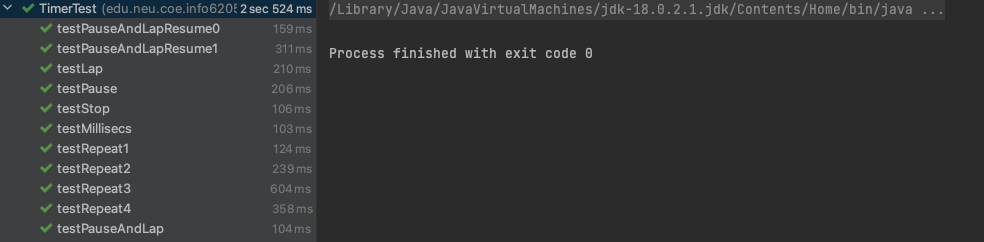
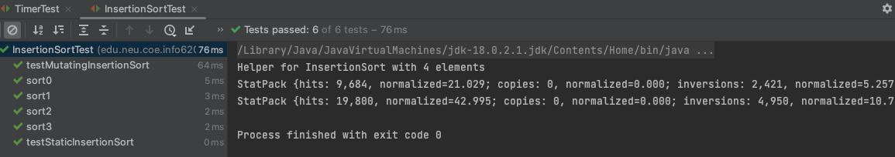
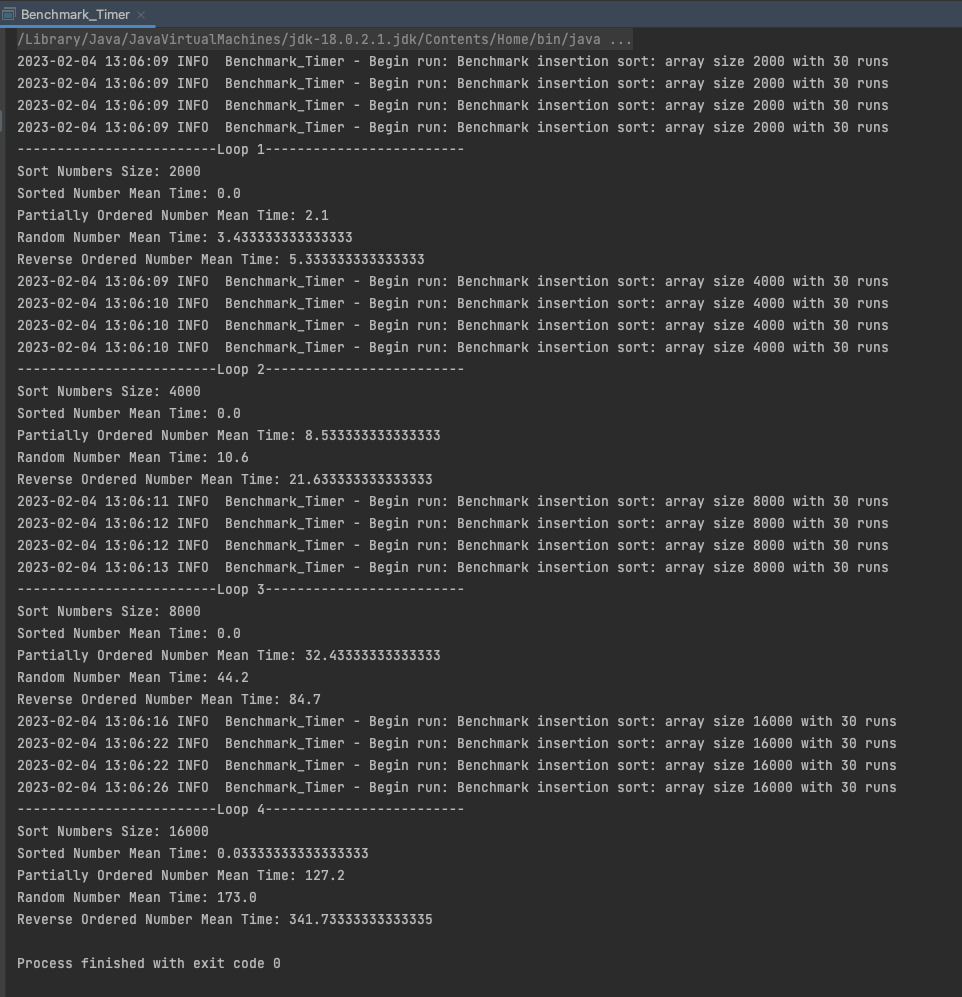

# Timer

## rkepeat

https://github.com/INEEDAMONITOR/INFO6205/blob/559c602574a0938bdb9f4f52bb000c5873a8fc49/src/main/java/edu/neu/coe/info6205/util/Timer.java#L60-L87

## getClock

https://github.com/INEEDAMONITOR/INFO6205/blob/559c602574a0938bdb9f4f52bb000c5873a8fc49/src/main/java/edu/neu/coe/info6205/util/Timer.java#L206-L211

## toMillisecs

https://github.com/INEEDAMONITOR/INFO6205/blob/559c602574a0938bdb9f4f52bb000c5873a8fc49/src/main/java/edu/neu/coe/info6205/util/Timer.java#L222-L227

## Test Timer



# InsertionSort

## sort

https://github.com/INEEDAMONITOR/INFO6205/blob/559c602574a0938bdb9f4f52bb000c5873a8fc49/src/main/java/edu/neu/coe/info6205/sort/elementary/InsertionSort.java#L58-L75

## Analysis

Iterate each element, `cur = nums[i]`. Compare `cur` with `nums[0 .. i-1]`.

For elements which greater than the `cur`, move to one position ahead.

```java
while (j >= from && helper.less(value, xs[j])) {
  helper.swap(xs, j, j + 1);
  j = j - 1;
}
xs[j + 1] = value;
```

## Test InsertionSort



# Main Program

## main

https://github.com/INEEDAMONITOR/INFO6205/blob/559c602574a0938bdb9f4f52bb000c5873a8fc49/src/main/java/edu/neu/coe/info6205/util/Benchmark_Timer.java#L132-L205

## Analysis

For best, sorted array, there will be no swap. It takes linear time $O(n)$.

For worst, reverse sorted array, for each element with index `i`, it will take `i` times swap. It takes $O(n^2)$ time.

Partially sorted is faster than random, because for the part of sorted it will take linear time. 

In a conclusion, TC
$$
\text{sorted} < \text{partially sorted} < \text{random} < \text{reverse soted}
$$

### Results

