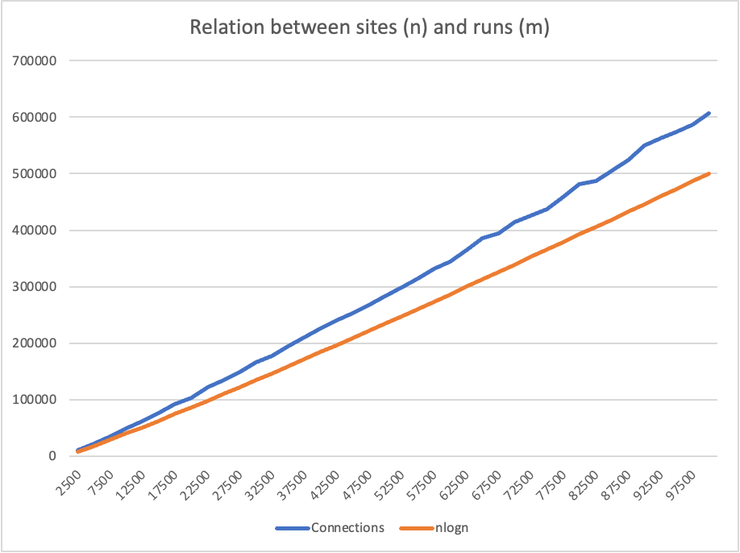

# Step 1: height-weighted Quick Union with Path Compression

## Implementation

### find

```java
public int find(int p) {
    validate(p);
    int root = p;
    // FIXME
    if (pathCompression) {
        doPathCompression(root);
        while (parent[root] != root) {
            root = parent[root];
        }
    } else {
        while (parent[root] != root) {
            root = parent[root];
        }
    }

    // END 
    return root;
}
```

### mergeComponents

```java
private void mergeComponents(int i, int j) {
    // FIXME make shorter root point to taller one
    if (height[i] < height[j]) {
        parent[i] = j;
        height[j] += height[i];
    } else {
        parent[j] = i;
        height[i] += height[j];
    }
    // END 
}
```

### doPathCompression

```java
private void doPathCompression(int i) {
    // FIXME update parent to value of grandparent
    parent[i] = parent[parent[i]];
    // END 
}
```

## Unit test


# Step 2: Union Find with n sites and m runs

## Implementation

### count

```java
private static int count(int pairsNum) {
    int averageConnectedCount = 0;
    int runs = 200;
    for (int i = 0; i < runs; i++) {
        int sites = pairsNum;
        UnionFind uf = new UnionFind();
        UF_HWQUPC uf_hwqupc = new UF_HWQUPC(sites, false);
        Random random = new Random();
        while (uf_hwqupc.components() != 1) {
            int node1 = random.nextInt(pairsNum);
            int node2 = random.nextInt(pairsNum);
            uf.updateTotalConnectedCount();
            if (node1 == node2) {
                continue;
            }
            if (!uf_hwqupc.isConnected(node1, node2)) {
                uf_hwqupc.union(node1, node2);
            }
        }
        averageConnectedCount+=uf.totalConnectedCount;
    }
    return averageConnectedCount/runs;
}
```

### main

```java
public static void main(String[] args) {
    for (int site = 2500; site <= 100000; site+=2500) {
        int count = UnionFind.count(site);
        System.out.printf("Site: %8d, connection: %8d, nlogn: %8d\n", site,count,  (int)(site * (Math.log10(site))));
    }
}
```

## Results


#  Step 3: Relation between sites (n) and connections/ runs (m)

## Assumption

For the first instinct, the runs (m) are proportional to the sites (n).

For the sites 2500 and rums 10635, 
$$
\text{Squre: }2500 ^2 = 6,250,000\\
\text{Logarithmic (Base 10)} \log_{10}{2500} \approx 3.40\\
\text{NlogN } 2500\cdot\log_{10}{2500}\approx 8,494
$$
By observing the first run of site 2500, let’s assume that $(n\log{n}) \propto m$.

## Results sheet

| Sites  | Connections | nlogn      |
| ------ | ----------- | ---------- |
| 2500   | 10635       | 8494.85002 |
| 5000   | 22611       | 18494.85   |
| 7500   | 35706       | 29062.9595 |
| 10000  | 48632       | 40000      |
| 12500  | 62773       | 51211.3752 |
| 15000  | 76665       | 62641.3689 |
| 17500  | 91344       | 74253.1659 |
| 20000  | 102900      | 86020.5999 |
| 22500  | 121355      | 97924.1067 |
| 25000  | 134984      | 109948.5   |
| 27500  | 148631      | 122081.649 |
| 30000  | 165706      | 134313.638 |
| 32500  | 177475      | 146636.209 |
| 35000  | 194040      | 159042.382 |
| 37500  | 209953      | 171526.173 |
| 40000  | 226152      | 184082.4   |
| 42500  | 240887      | 196706.53  |
| 45000  | 252519      | 209394.563 |
| 47500  | 266978      | 222142.946 |
| 50000  | 283718      | 234948.5   |
| 52500  | 298632      | 247808.363 |
| 55000  | 313840      | 260719.948 |
| 57500  | 331066      | 273680.901 |
| 60000  | 344885      | 286689.075 |
| 62500  | 363914      | 299742.501 |
| 65000  | 385103      | 312839.368 |
| 67500  | 394138      | 325978.005 |
| 70000  | 413731      | 339156.863 |
| 72500  | 425730      | 352374.505 |
| 75000  | 436979      | 365629.595 |
| 77500  | 458830      | 378920.882 |
| 80000  | 480826      | 392247.199 |
| 82500  | 487035      | 405607.451 |
| 85000  | 505340      | 419000.609 |
| 87500  | 523544      | 432425.705 |
| 90000  | 549212      | 445881.826 |
| 92500  | 562165      | 459368.11  |
| 95000  | 574455      | 472883.743 |
| 97500  | 586475      | 486427.95  |
| 100000 | 607276      | 500000     |

## Results visuliazation



## Conclusion

The slop of the $n\log(n)$ and $m$ are different. There may have a constant value before $n\log{n}$, like $a\cdot\log(n)$. And with the sheet and the chart, we can see that $m \propto n\log{n}$.

