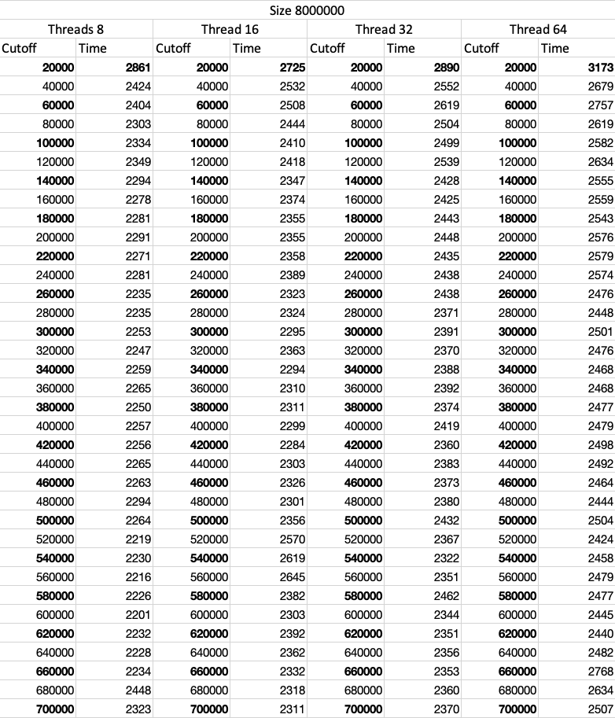

# Assignment 5 (Parallel Sorting)

## Goal

Draws a conclusion (or more) about the efficacy of this method of the parallelizing sort. Your experiments should involve sorting arrays of sufficient size for the parallel sort to make a difference.

## Analysis

To draw the efficacy of parallelizing sort, there are variables that need to be considered:

- Array size
- Thread or the parallelism
- Cutoff scheme

## Code

I modify the code so that we can see the difference between different array sizes, threads, and the cutoff schemes.

https://github.com/INEEDAMONITOR/INFO6205/blob/8c5e0e8b511b6db6ece27dd02ecc93ea6fccf1a2/src/main/java/edu/neu/coe/info6205/sort/par/ParSort.java#L14

I add parallelism, so we can set it at `Main.java`

In the `Main.java`, I build a `runExperiment` method, so I can set different `arraySize` and `threads`

https://github.com/INEEDAMONITOR/INFO6205/blob/8c5e0e8b511b6db6ece27dd02ecc93ea6fccf1a2/src/main/java/edu/neu/coe/info6205/sort/par/Main.java#L65

In the `main`, I test the array size from 2000000 to 64000000 with threads from 8 to 64.

https://github.com/INEEDAMONITOR/INFO6205/blob/8c5e0e8b511b6db6ece27dd02ecc93ea6fccf1a2/src/main/java/edu/neu/coe/info6205/sort/par/Main.java#L59-L63

## Result

I set the cutoff range between 20000 to 2000000. The cutoff range will affect the results. 

I store the result in the `./Data` files. I only finish the array sizes, 2000000, 4000000, and 8000000 because of the speed.

### Array Size 2000000

### Array Size 8000000

### Array Size 8000000

## Relationship

### Array size

First of all, the time increase as the array size increase which is obvious.

### Cutoff

By observing the array size 2000000, we can find that the cutoff range $[20000, 580000]$ is the fastest.

Range $[580000, 860000]$ is relative fast, when the cutoff is larger than $860000$, the speed drop significant.

Therefore

- when the cutoff is around $5\% - 30\%$ of the array size, the speed is fast
- The cutoff around $30\% - 50\%$ is faster
- When the cutoff is above the $50\%$, the speed drops a lot, therefore we do not want to the cutoff exceeds the half of the array size.

For the array size 4000000, we can see the same patten.

- The fast range is $[100000, 1060000]$, which is from $2.5\%$ to $26.5\%$.
- And the next speed drop should appears at 2000000

For the array size 8000000,

The fastest range should be below $2400000$ ($30\%$). Because of the max cutoff is 2000000, we can not see the change of speed.

