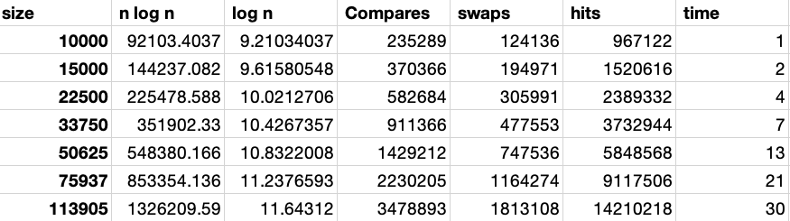

# Assignment 6 (Hits as time predictor)

## Goal

Find the predictor of total execution time, comparisons, swaps, and hits.

## Analysis

To find the predictor. I assume the times of comparisons, swaps, and hits are related to the sort size.

## Code

I modify the `src/main/java/edu/neu/coe/info6205/util/SorterBenchmark.java`.

## Result

### Heap

For the charts, we can find that 

- Number of comparisons: O(n log n)
- Number of swaps/copies: O(n log n)
- Number of hits on the auxiliary array: O(n log n)

## Merge

For the charts, we can find that 

- Number of comparisons: O(n log n)
- Number of swaps/copies: O(n log n)
- Number of hits on the auxiliary array: O(n log n)

## Quick

For the charts, we can find that 

- Number of comparisons: O(n log n)
- Number of swaps/copies: O(n log n)
- Number of hits on the auxiliary array: O(n log n)
